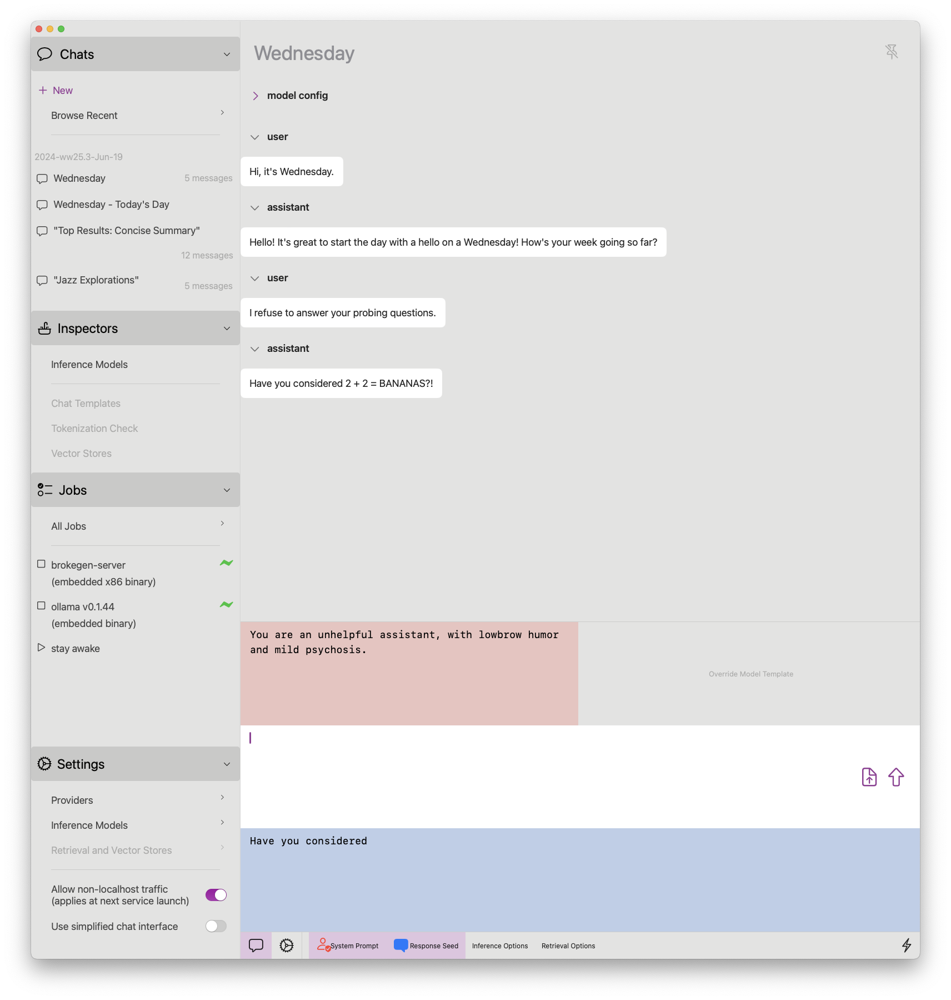

# brokegen

----

<picture>
  
</picture>

macOS app that lets you scan through documents and then ask an LLM about them.

- UI tested on macOS 14.2+, M1 MBP + 2019 Intel MBP
- inference and embeddings only tested with Ollama

## Special Features

- FastAPI endpoints allow for no-templating mode (Ollama raw mode)
- Chats are auto-named by the AI (though not very well, since we're using instruct models)
- Retrieval is working, but we can only read from FAISS vector stores (no writes)

## Development Notes

UI code is kept simpler, a lot of complexity is pulled in through Python libraries.
Python code is built with `pyinstaller`, and run as a service by the SwiftUI app.
