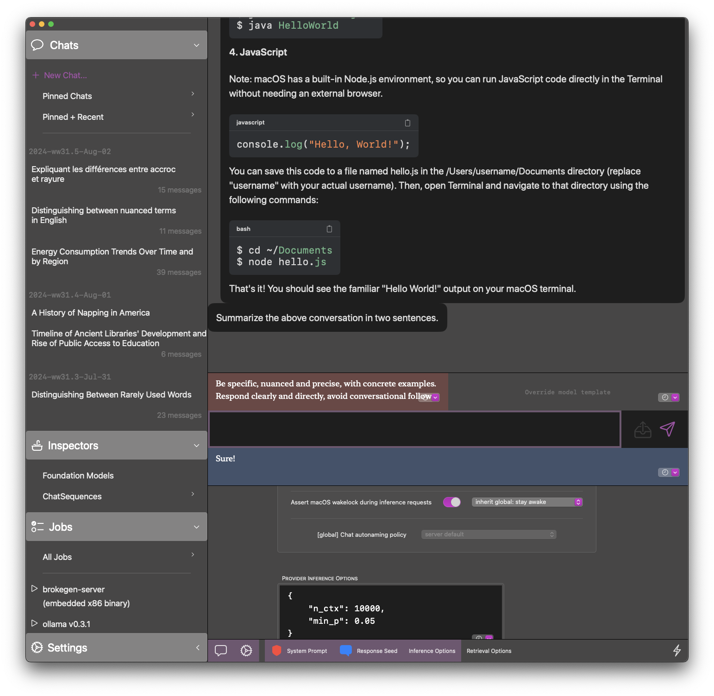

# brokegen

----

<picture>
  
</picture>
<picture>
  
</picture>

macOS app to chat with local foundation models. Ollama is well-supported, and .gguf files are loaded via llama-cpp-python (put/symlink them in `~/Library/Application Support/faux.brokegen/`).  
Key differentiator is a focus on data capture and retention; text and inference stats are stored in SQLite databases, which also makes it easy to import data from external sources.

## Features

- Virtually all settings are overrideable (model template, system prompt, start of assistant response, ollama/llama.cpp inference options)
- Chats can be branched at any point, and inference models re-selected at any point
- Ollama proxy is built-in, so any messages sent through other apps will be captured and show up in brokegen (only `/api/chat` requests, not `/api/generate`). When the server is started, the proxy is available on `http://localhost:6635/ollama-proxy`.

Minor features:

- Chats are optionally auto-named by the UI (the naming prompts in the app work best with llama3 models)
- Overridden prompts/templates are stored in a SwiftData store, while broad settings like "render as markdown" are stored using `@AppStorage`
- User/assistant messages can be sent in any order (continue assistant inference even during its turn + keep "saving" user messages without inference), though this depends on the model template + whether the model handles out-of-turn events well.

## Requirements
Tested and developed on macOS 14.2+, M1 MBP + 2019 Intel MBP. Pre-built binaries are x86 only, compiled for AVX2 CPU's and will run inference very slowly (estimated 3-6 tokens/sec for quantized mistral-7b, maxing out the 8 CPU cores on an Intel MBP).

If you don't need to run custom models, install Ollama and use that as the inference provider:

1. Download from <https://ollama.ai> and open the application.
2. Once the command-line utility is installed, open a terminal and run `ollama pull <MODEL_NAME>`.
   The full list is available at <https://ollama.ai/library>.
3. Once the model has finished downloading, you can start using it.

Or, if you would rather use the embedded ollama binary, you can run a command like `./Brokegen.app/Contents/Resources/ollama-darwin pull mistral:7b`, and use that for inference.

## Development Notes

UI code is kept simpler, a lot of complexity is pulled in through the built-in Python server.

Python code is built with `pyinstaller`, and run as a service by the SwiftUI app.
An embedded copy of ollama is also included, though you'll have to download models yourself.

- There is some support for reading langchain/FAISS vector stores, but the write code hasn't been added yet. RAG infrastructure is largely there, but I'd prefer to add a DSPy-centered implementation.
- For newer models like `mistral-nemo` and `llama3.1`, scaling the context up to 128k generally consumes more than 64 GB of RAM, so default context size is 512 tokens + user is expected to override these in the UI inference options.
- The llama-cpp-python provider defaults to CPU inference, which will be significantly slower on Apple Silicon Macs.
  Override this in inference options (`{"n_gpu_layers": -1}`), or use Ollama.
- Multi-modal support is non-existent; the `/ollama-proxy` endpoint supports forwarding image files to any ollama model that indicates support for it (e.g. `llava`), but image data will not be captured or replayable.
