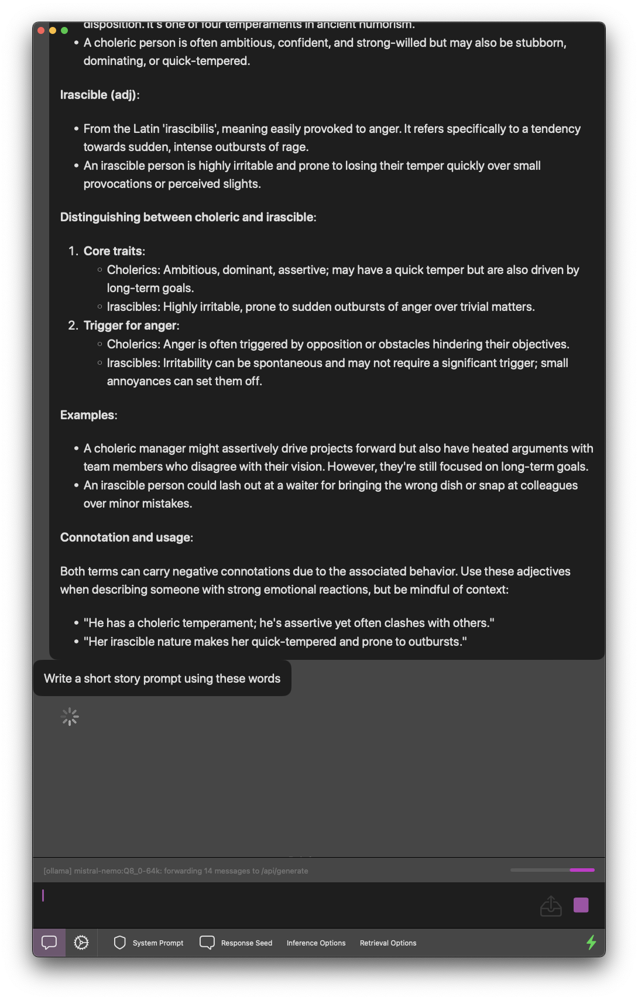

# brokegen

----

<picture>
  
</picture>

macOS app that lets you scan through documents and then ask an LLM about them.
Key differentiator is a focus on data retention; text and inference stats are stored in a SQLite database.

Tested and developed on macOS 14.2+, M1 MBP + 2019 Intel MBP

To get started with Ollama, follow these steps:

1. Download from ollama.ai and open the application
2. Open a terminal and run `ollama run <MODEL_NAME>`.
   Example model names are `codellama:7b-instruct` or `llama2:7b-text`. You can find the full list at <https://ollama.ai/library>.
3. Once the model has finished downloading, you can start using it.

## Special Features

- Chats are auto-named by the AI
- Retrieval is working, but we can only read from FAISS vector stores (no writes)

## Development Notes

UI code is kept simpler, a lot of complexity is pulled in through a built-in Python "server".

Python code is built with `pyinstaller`, and run as a service by the SwiftUI app.
An embedded copy of ollama is also included, though you'll have to download models yourself, for now.

